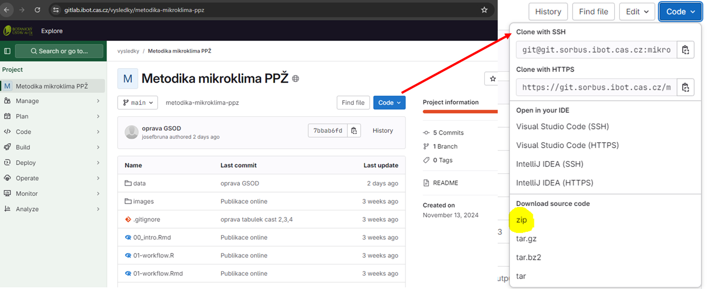
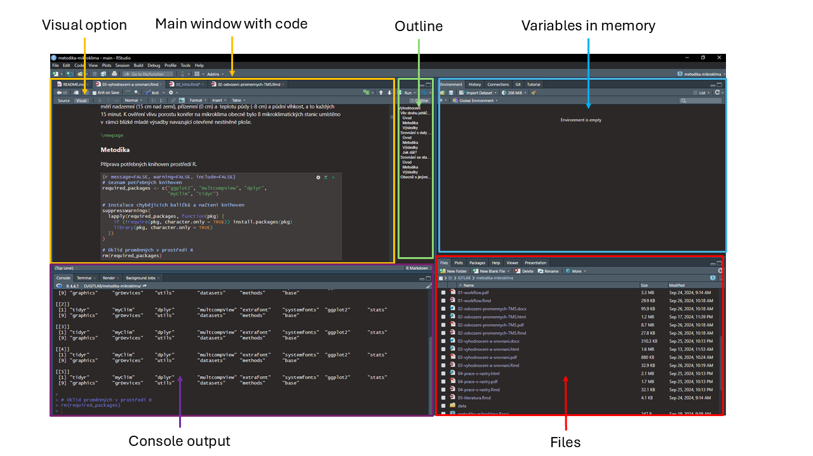
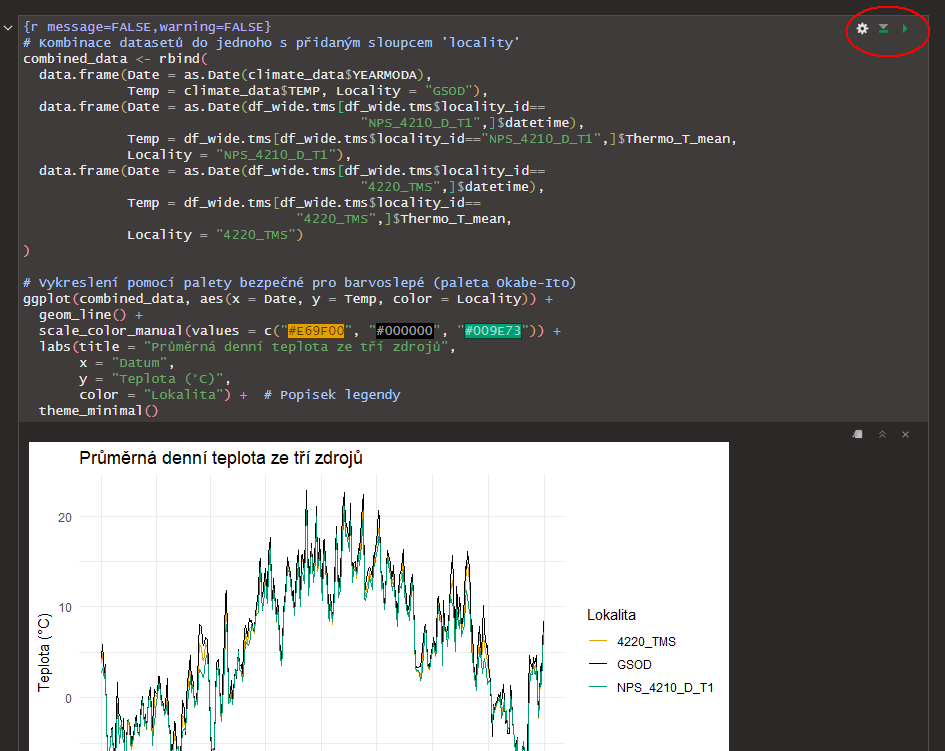

\thispagestyle{empty}

```{r, results='asis', echo=FALSE}
if (knitr::is_latex_output()) {
  cat("\\noindent\\rule{\\textwidth}{0.5pt}")
} else {
  cat('<hr style="width: 100%; height: 1px; border: none; background-color: black;">')
}
```

NmetS - Methodologies approved by the relevant state administration body under whose competence the given issue falls

\
This methodology is a result of the project: **Forest microclimate in time and space: real impacts of climate change on selected protected areas**

\

Project number: **SS06010011**

Project start: **04/2023**

Project end: **03/2026**

Project investigator: Institute of Botany of the Czech Academy of Sciences, Zámek 1, Průhonice, 25243, Czech Republic

Confidentiality and availability: S – Complete and truthful project data not subject to protection under special legal regulations.

Original release: **2024**

Version: **1.1**

Updated: 22.5.2025 (Update to myClim 1.40)

Tested with R 4.4.1, myClim 1.40, RStudio 2025.05.0

\
**English version was translated by AI - Claude Sonnet 3.5 and manual checking was not done yet.**

\
\
{width="600"}\

*This project is funded with state support from the Technology Agency of the Czech Republic and the Ministry of the Environment of the Czech Republic under the Environment for Life Program.*

\newpage

**Information about the author team:**

RNDr. Josef Brůna, Ph.D., Principal Investigator

Mgr. Tereza Klinerová, Research Team Member

Mgr. Martin Kopecký, Ph.D., Research Team Member

Mgr. Martin Macek, Ph.D., Research Team Member

Mgr. Matěj Man, Research Team Member

Mgr. Anna Růžičková, Research Team Member

doc. Ing. Jan Wild, Ph.D., Research Team Member

\
\
\

{width="282"}\
\
\
\
\
\
\
\
\
\
\
\
\
\
\
\
\
\
\
{width="600"}\

*This project is funded with state support from the Technology Agency of the Czech Republic and the Ministry of the Environment of the Czech Republic under the Environment for Life Program.*

\newpage

\renewcommand{\contentsname}{Contents}
\tableofcontents

\newpage

# Introduction

Microclimatic measurements are now widely available thanks to the development of automated autonomous measuring instruments, but their processing can be challenging due to large data volumes and non-standardized output data formats as well as non-standardized measurement methods depending on the specific research question. Therefore, they are only occasionally used in nature conservation (e.g., when assessing the impact of climate on protected features). The aim of this methodology is to facilitate the use of microclimatic data in nature conservation practice and ensure reproducibility of results through practical examples and proven procedures. The target user group is primarily staff of National Park and Protected Landscape Area administrations, as well as staff of the Nature Conservation Agency.

The first part of the methodology focuses on deriving biologically relevant variables, particularly based on time series from TOMST microclimatic stations, but also from other sources, so that other compatible data can be used as well. The main motivation is the fact that while classical meteorological data is already standardized and offers a number of comparable variables available from different sources, data from compact microclimatic stations is far from being as standardized and analysis of data obtained from individual stations can be challenging at first glance. Using examples based on real data, we will show the main problems in data processing and recommend proven procedures. The second part of the methodology focuses on the practical use of derived variables for data evaluation and also the use of microclimatic and climatic maps.

The methodology describes procedures for obtaining and processing microclimatic measurements from autonomous dataloggers (installation, data management, data quality control, processing and visualization of measured values, basic data analysis) completely in the open-source [R](https://www.r-project.org/) programming environment. We believe that the absence of ties to commercial software will facilitate its use. Another advantage of processing data in R is the reproducibility of procedures and results, as all data operations remain documented in the source code.

\newpage

## How to work with the methodology

This methodology exists as a standalone document (in .pdf format), but is also available online including all source files used in the data processing examples. The entire project for [RStudio - https://www.rstudio.org/](https://www.rstudio.org/) and the individual tasks presented in it can thus be run by users and the code can be modified for their own needs on their device.

The .Rmd format combines the actual document text and executable R code; for custom analyses, individual parts of the code can be transferred to a new script in R format. At the same time, the codes of individual parts of the methodology are available for the R environment without the surrounding text (.R format).

Due to the dynamic nature of R libraries, the online version of the methodology will be continuously updated during project implementation to be compatible with the current development of the *myClim* library (Man et al. 2023) and other important libraries and data sources. Minor deviations may still occur and cause errors in code execution; please do not hesitate to contact us if needed.

The online version with all sample data is available here: <https://gitlab.ibot.cas.cz/vysledky/microclimate-methodology>

From there, you need to download from the web using the **Code** button - select **zip** here. The direct link is: <https://gitlab.ibot.cas.cz/vysledky/microclimate-methodology/-/archive/main/microclimate-methodology-main.zip>

{width="520"}

Then extract the contents on your disk and open the microclimate-methodology.Rproj file in [RStudio](http://www.rstudio.org/).

In the RStudio window, you can then open individual **Rmd** files (**Figure 2**, in the files section at the bottom right) and run the code in the main window using the green arrows in the top right corner of each code window:

We recommend displaying with formatting using the **Visual** button. In the section with variables in memory, you can find currently loaded variables and examine their contents. Navigation is facilitated by an outline that can be turned on in the right part of the main window using the **Outline** button. At the bottom left is the console output, where you can see the progress of individual commands and some less important outputs may be displayed, as well as error messages.

{width="530"}

The main outputs (images) are always below each code block (**Figure 3**). Individual chapters need to be run sequentially from top to bottom, as subsequent code blocks often use variables created in previous blocks.

{width="530"}

\newpage

```{r child="01-workflow-en.Rmd", eval=T}
```

\newpage

```{r child="02-variables-calculation-TMS.Rmd", eval=T}
```

\newpage

```{r child="03-evaluation_and_comparison_v3.Rmd", eval=T}
```

\newpage

```{r child="04-working-with-rasters.Rmd", eval=T}
```

\newpage

```{r child="05-literature.Rmd", eval=T}
```
