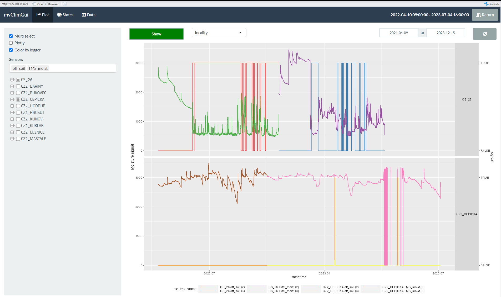

## Environment Setup and Functions for Table Rendering

```{r setup, message=FALSE, warning=FALSE, include=FALSE}
# Determine output format (html, pdf, docx) from RMarkdown
output <- knitr::opts_knit$get("rmarkdown.pandoc.to")
if (knitr::is_latex_output()){output<-"pdf"}
if (is.null(output)) {output <- "html"}

# Install and load libraries
options(kableExtra.auto_format = FALSE)
suppressWarnings(lapply(c("kableExtra", "knitr","flextable"), function(pkg) {
  if (!require(pkg, character.only = TRUE))
    install.packages(pkg, repos = "https://mirrors.nic.cz/R/")
  library(pkg, character.only = TRUE)
}))
# Custom function for table creation

default_kable <- function(data, ...) {
  if(output == "docx") {
  flextable(data) %>% 
      set_table_properties(width = 1, layout = "autofit") %>%
      fontsize(size = 7, part = "body") %>% fontsize(size = 8, part = "header") %>%
      height(height = 0.5, part = "body") 
  } else if (output == "pdf") {
    # Output for PDF (LaTeX)
    kable(data, format = "latex", booktabs = TRUE, position = "H", ...) %>%
    kable_styling(font_size = 7)
  } else if (output == "html") {
    kable(data, format = "html", booktabs = TRUE, ...) %>%
      kable_styling(bootstrap_options = c("striped", "hover", "condensed"),
                    font_size = 7, full_width = FALSE, position = "center") %>%
      knitr::asis_output()
  } else {
    # Safety fallback to LaTeX
    kable(data, booktabs = TRUE, ...) %>%
    kable_styling(font_size = 7) %>%
    print()
  }
}
```

# 1. Workflow

In this initial section, we will focus on obtaining relevant microclimatic data and preparing it for input into subsequent analyses. We will go through the entire process from installing sensors in the field, through data downloading to their control, cleaning, calibration, and joining time series from multiple readings. We will also show how to keep records of sensor history (e.g. readings, sensor exchanges within a location) and set up an appropriate structure for storing downloaded data.

We emphasize working with [TMS (TOMST) system sensors - https://tomst.com/web/en/systems/tms/](https://tomst.com/web/en/systems/tms/), currently widely used worldwide for microclimatic measurements (Lembrechts et al., 2022), but the methodology can be generalized to other sources of microclimatic data - e.g., from instrumental measurements by HOBO (Onset), iButton (Maxim/Dallas), Minikin (EMS Brno), EnvLoggers (ElectricBlue) and others. For working with microclimatic data, we use the R library *myClim* (Man et al., 2023), in which we have gathered experience from many years of working with microclimatic data.

## 1.1. Installation of TMS Sensors in the Field

Proper installation of TMS sensors in the field is a basic prerequisite for obtaining relevant microclimatic data. It is preceded by the selection of representative locations for sensor placement, which depends on the specific research question. Following uniform procedures ensures the comparability of measured data. Detailed information is summarized in the *Methodology for measuring microclimate using TMS system microclimatic stations* (Brůna et al., 2021); here we provide only a brief summary.

#### Thermologger

The Thermologger (TOMST) sensor is an autonomous datalogger measuring air temperature. It is mounted using an M5 metric thread into white shielding, protecting the sensor from direct sunlight, typically in a vertical position at a height of 2 m above ground (unless the nature of the research question requires different placement). In forest stands, it can be placed on the north side of a tree trunk **(Fig. 4 A and B)** or on an inexpensive and durable plastic-coated garden stake.

{width="550"}

#### TMS-4 datalogger

The TMS-4 datalogger (TOMST) was designed for monitoring microclimatic variables relevant to the herb layer (Wild et al., 2019). The TMS-4 datalogger measures temperature at three positions - air temperature 15 cm above ground, soil surface temperature, soil temperature 8 cm below soil surface, and soil moisture. The sensor is typically installed in a protective cage that prevents damage by wildlife and falling branches **(Fig. 4 E)**, with the signal LED facing south; the correct burial depth of the lower (green) part of the datalogger with the soil moisture and temperature sensor is shown in **Fig. 4 C**. If the sensor is installed in stony soil, it is advisable to use an auxiliary metal tool to dig the hole to avoid scratching or completely damaging the soil moisture sensor (circuit on the PCB). It is important to check that the entire lower part of the sensor is in good contact with the soil (the sensor holds firmly in the dug hole, does not wobble) and to fill any air pockets with soil substrate. Single or double shielding can be used to shield the sensor from direct sunlight. Two variants of sensor placement on the research plot are shown in **Fig. 4 D** (Thermologger on tree) and **Fig. 4 F** (Thermologger on plastic-coated pole).

## 1.2. Data Download and Management

The interface for sensor operation (**Fig. 5**) - data downloading and basic data view is provided by the [*Lolly* software from the TMS sensor manufacturer](https://tomst.com/web/en/systems/tms/software/). During first installation, you need to have a TMD adapter connected to your computer. A complete guide for operating the software can be found on the [manufacturer's website: https://tomst.com/web/wp-content/uploads/2023/06/Lolly-software-Handbook.pdf](https://tomst.com/web/wp-content/uploads/2023/06/Lolly-software-Handbook.pdf) (in English).

From a practical use perspective, we particularly point out:

-   ability to set different measurement intervals
-   ability to set different date and time formats (pay attention to compatibility with *myClim*)
-   ability to create a bookmark
-   ability to read data from a specific date or bookmark
-   ability to display an overview graph of measured data

.](images/img6_lolly_options.png)

Time series with measured values are stored after reading the datalogger into a CSV file named with the text string:

"data\_" + serial number + year_month_day + reading sequence number + ".csv"

The file contains tabular data in the form of semicolon-separated values. The individual columns represent sequentially: observation sequence number, measurement date and time in UTC, time zone code, temperature sensor T1, temperature sensor T2, temperature sensor T3, soil moisture, shock indicator, error flag. For TOMST TMS-4 loggers, T1 is the soil sensor (-8cm), T2 is the ground sensor (+2cm), T3 is the air sensor (+15cm). For TOMST Thermologger, temperature is stored in field T1, other unused fields contain value -200.

Additionally, a "command\_\*.csv" file containing a log of the reading process is stored along with the data, which we won't need for further work, but we recommend archiving it for possible troubleshooting with the manufacturer.

It is advisable to store downloaded data on cloud storage for online data backup (ability to set the path for storing data in a synchronized folder directly in the *Lolly* software). It is appropriate to store data in folders so that it is subsequently easy to link field notes with the data storage. For example, if we read data once a year, then name folders according to the given year and organize notes in field records also with the tag of the given year. We archive a copy of downloaded files preferably in a compressed archive (.zip) to save space, as .csv files are data intensive.

If you need to change the date and time format retrospectively for already read data, you can use the *Lolly* software (unofficial guide see **Fig. 6 A-C**).


Field data collection should be done once or twice a year (spring, autumn) to prevent larger data loss in case of sensor failure. For routinization and easier coordination of reading work, you can use the "field manual" given in Appendix 1 of the above-mentioned *Methodology for measuring microclimate using TMS system microclimatic stations* (Brůna et al., 2021). It is necessary to record the progress of reading and all non-standard events (sensor pulling out, fallen shielding, ID of newly installed sensor, etc.). These notes are essential for proper data processing:

a)  to check whether we have readings from all sensors and locations,
b)  for correct interpretation of data and evaluation of possible errors in data.

### Common Problems and Failures Detectable Directly in the Field

-   **poor contact of the lower part of TMS-4 sensor with soil**

If the sensor is loose in the soil, there is a risk of inaccurate soil moisture measurement due to poor contact with soil (sensor measures only in a small volume of soil closely adhering to the sensor). In the graph, the problem manifests as sudden drops in moisture, or generally low values (below 1000 units). The sensor needs to be reinstalled. We note the problem and during processing of measured values we exercise increased caution regarding soil moisture, possibly replacing soil moisture values with NA.

-   **pulled out TMS-4 sensor**

If a TMS-4 sensor is found lying freely on the soil surface (and is not visibly mechanically damaged), check the functionality of the sensor in *Lolly* software (no measurement dropouts, constant or obviously nonsensical values of measured variables are visible in the overview graph). If the sensor is functional, reinstall it. However, when processing data, it is necessary to find out when the sensor was pulled out of the soil, which can be recognized by a sudden equalization of temperatures T1, T2 and T3 and a sharp drop in soil moisture values. In that period, we must then replace all data series with NA values (temperature T2 measured at the soil surface can be preserved with a liberal approach), more details below. The *myClim* library also offers a function for automatic detection of data measured on a pulled out sensor `mc_prep_TMSoffsoil()`.

-   **fallen shielding**

Especially TMS sensors without wildlife protection suffer from loss of shielding. The shielding needs to be returned to the sensor. In such a case, the measured temperatures are not comparable with values measured on shielded sensors (especially temperature 15 cm above ground and temperature at soil surface). Shielding prevents sensor overheating when direct sunlight hits the sensor.

-   **sensor failures**

Recognizable in the overview graph in *Lolly* software. If these are one-time events, sensor functionality may not be limited and we can leave it in place. If the failures are more extensive, replace the sensor with a new one. If an entire time period is missing, it may be a data transfer error during reading. In such a case, repeat the reading. If reading from bookmark is set, it is necessary to temporarily change this option and read the sensor entirely or from a specific date, because a new bookmark has probably already been created.

-   **time shift**

During each reading, the time in the computer and in the sensor is synchronized. If the internal time on the sensor and in the computer significantly disagree (i.e., difference more than 10 minutes shown in *Lolly* in the "Delta:" field - **Figure 5B**), this fact needs to be noted in field records and find out the probable cause. It may be due to lagging internal datalogger clock, e.g., in sensors with weakening battery. It may also be an error due to incorrectly set system time on the computer either during the previous reading or during the current reading (note: TMS sensors show UTC time, so they differ from Central European time by 1 hour, or by 2 hours from summer time).

## 1.3. Record Keeping

A necessary condition for preparing relevant input data is records about sensor placement at the location and notes from field readings, which serve for correct interpretation and evaluation of data. During site visits, it is therefore necessary to record all changes in sensor status. This information is then an integral part of subsequent processing. The simplest example of such a record table for our sample data might be this:

```{r 01-load, message=FALSE, warning=FALSE, include=FALSE}
# Install and load libraries
suppressWarnings(lapply("openxlsx", function(pkg) {
  if (!require(pkg, character.only = TRUE))
    install.packages(pkg, repos = "https://mirrors.nic.cz/R/")
  library(pkg, character.only = TRUE)
}))
```

```{r 01-load_notes, message=FALSE, warning=FALSE}
# Loading field notes from Excel
zaznamy <- read.xlsx("./data/zaznamyR.xlsx")
```

```{r 01-table_notes, message=FALSE, warning=FALSE, include=T, echo=F, tab.cap="Example of field notes"}
default_kable(head(zaznamy, 20))
```

For each reading (in the case of our sample data, readings once per year), it is necessary to record the datalogger serial number (ID) (printed on the tube), unique location identifier, and other notes about the reading for unambiguous identification. In our example, the same dataloggers are located at the sites permanently, but this may not be the rule - if damage occurs or the datalogger is replaced over time, the ID changes. Thanks to these records, we will later be able to correctly assign data series to individual locations, even if the datalogger is replaced. We also strongly discourage renaming files that are identified by the datalogger serial number, because the datalogger serial number also serves to assign calibration data. From the reading notes, it is clear that when processing data, we will need to focus on dataloggers at locations CS_26, where the datalogger was pulled out of the ground, which invalidated the measurements, and we will also focus on locations CZ2_CEPICKA and CZ2_LUZNICE, where we have a note about moisture sensor failure.

## 1.4. Loading and Cleaning Raw Microclimatic Data

Example of data preparation for further analysis from raw field data. As an example, we present data measured at 10 locations across the Czech Republic. At all locations, TOMST TMS-4 dataloggers were placed measuring air temperature at heights of 15 cm and 2 cm above soil surface, 8 cm below soil surface, and soil moisture in the top soil layer (0 - 15 cm). At 9 locations, there was also a Thermodatalogger measuring air temperature 200 cm above ground and a HOBO U23 datalogger measuring air temperature and relative humidity 150 cm above ground. The time series contains measurements from approximately April 2021 to October 2023, but not all dataloggers measured for the same duration, there are missing segments in the data.

```{r 01-library_load, message=FALSE, warning=FALSE,results='hide'}
# List of required libraries
required_packages <-
  c("myClim", "dplyr", "tidyr", "stringr", "openxlsx", "ggplot2")

# Install and load libraries
suppressWarnings(lapply(required_packages, function(pkg) {
  if (!require(pkg, character.only = TRUE))
    install.packages(pkg, repos = "https://mirrors.nic.cz/R/")
  library(pkg, character.only = TRUE)
}))

# Clean up variables in R environment
rm(required_packages)
```

We have installed and loaded the necessary libraries for working with microclimatic data and now we will load information about files read in the field. For data processing in the *myClim* library, it is important to correctly assign individual files to locations, correctly enter the expected data format (type of datalogger from which the data comes), and further define in what format dates and times are given in the files (whether it is e.g., 2023.12.31 12:00 or 31.12.2023 12:00:00). We call this definition file **files_table,** we can create it in code from our record table or manually in a spreadsheet editor and then load it in CSV format.

```{r 01-create_files_table, message=FALSE,warning=FALSE}
## assembly of files_table from the above loaded excel table "zaznamy"
## in combination with paths to downloaded files from loggers
## Getting paths to downloaded files
soubory <- list.files("./data/example_data_prep_calc",
                      recursive = T,
                      full.names = T)
## Extraction of ID for 2 types of loggers from file names (TMS, HOBO)
jmena <- basename(soubory) # file names
logger_id <-
  str_match(jmena, "data_\\s*(.*?)\\s*_") # extraction of TOMST TMS ID
hob <-
  is.na(logger_id[, 2]) # which loggers don't have TMS ID, those are HOBO
logger_id[hob] <-
  substr(jmena[hob], 1, 8) # extraction of HOBO logger IDs

## Extraction of reading year from folder name where data is located
odecty <- basename(dirname(soubory))

## Now we know the path, logger ID and reading year.
ft <- data.frame(path = soubory,
                 logger_id = logger_id[, 2],
                 odecty = odecty)

## However, we still lack information about location, logger type and date format
## we get this information from the field records table
## we need a key of which loggers were at which location in which year
## these are columns 3,5,7
zaznamy.dlouha <- pivot_longer(zaznamy,
  cols = c(3, 5, 7),
  names_to = "odecty",
  values_to = "logger_id")

## columns with notes are not needed now
## we get a table with key locality-logger_type-reading-logger_id
zaznamy.dlouha <- zaznamy.dlouha[,-c(3:5)]

## create "files_table"
## joining location key and path to files by logger ID and reading year
files_table <-
  merge(ft, zaznamy.dlouha, by = c("logger_id", "odecty"))

## derive myClim data type from logger type information
data_format <- files_table$logger_type
data_format[data_format == "Thermo"]  <- "TOMST"
data_format[data_format == "TMS4"]    <- "TOMST"
data_format[data_format == "HOBO_RH"] <- "HOBO"
files_table$data_format <- data_format

## by examining date columns in our logger files
## we find that HOBO files have a consistent date format
## TOMST files have 4 date formats
## date format depends on reading software settings
## the more people and computers involved in downloading data, the more possible formats
date_format <- files_table$data_format
date_format[date_format != "HOBO"] <-
  "%d.%m.%Y %H:%M:%S@%d.%m.%Y %H:%M@%Y.%m.%d %H:%M@%d.%m.%Y"
date_format[date_format == "HOBO"] <- "%d.%m.%Y %H:%M:%S"
files_table$date_format <- date_format

## Keep only necessary columns
files_table <-
  files_table[, c("path", "locality_id", "data_format", "date_format")]
```

The files_table.csv file must follow the given structure (see Table 2):

```{r 01-print_files_table, message=FALSE, echo=FALSE, warning=FALSE, results='markup',tab.cap="Example structure of table defining file association with locations and file data type"}
default_kable(head(files_table,10))
```

Now we will load the actual data from microclimatic stations into one *myClim* object (raw format):

```{r 01-read_tms_data, message = FALSE, warning = FALSE, eval = FALSE}
## Loading microclimatic data into myClim
## assigning loggers to locations according to "files_table"
micro.data <-  mc_read_data(files_table = files_table,
               silent = F,
               clean = F)

## Loading using files_table prepared manually, saved to .csv file
micro.data <-  mc_read_data(files_table = "./data/files_table.csv",
               silent = F,
               clean = F)

## Perform basic machine cleaning and data checking, time step consistency
## duplicates, time axis sequence, missing values
micro.data.clean <- mc_prep_clean(micro.data, silent = T)
```

For a basic overview of the data, we will print out information about data range, measurement step and errors in data (missing values, duplicates, wrong ordering).

```{r 01-speedup, message=FALSE, warning=FALSE, include=FALSE, results='hide'}
# Previous chunk "01-read_tms_data" is turned off, takes too long
# Loading previously prepared output  
micro.data.clean <- mc_load("./data/prep_CZ2_10_clean.rds")
```

```{r 01-mc_info, message=FALSE, warning=FALSE}
## Printing information about loggers: data range, measurement step, 
## duplicates, order, missing data
info.tms <- mc_info_clean(micro.data.clean)
```

```{r 01-info_table, echo=FALSE, message=FALSE, warning=FALSE, tab.cap="Result of data check in object 'micro.data.clean' - measurement range, counts of duplicate, missing and chronologically incorrectly ordered records."}
info.tms.print <- info.tms
info.tms.print$start_date <- substr(info.tms.print$start_date, 1, 10)
info.tms.print$end_date <- substr(info.tms.print$end_date, 1, 10)
colnames(info.tms.print) <-
  c("locality_id", "serial_number", "start_date", "end_date", "step",
    "duplicities", "missing", "disordered", "rounded")
default_kable(head(info.tms.print, 10))
```

We are working with data from autumn 2021 to autumn 2023 measured at 10 locations across the Czech Republic. These are data from three different reading actions. The protocol printout from machine control from the *myClim* library `mc_info_clean()` shows a concerning number of duplicate values and values in incorrect order in some files. Upon closer examination of individual files, we will see that parts of the time series are indeed repeated in .csv files for certain dataloggers. This is a known bug occurring in data read using an older version of the *Lolly* reading software. We demonstrate such "damaged" files here intentionally. No measurements are missing in the data, on the contrary, there are extra ones. Without machine control `mc_prep_clean()` it would be very difficult to detect this problem. Similarly with incorrect ordering of consecutive measurements on the time axis.

If one measurement is missing in the data or there are a few duplicates in the data, it is usually an error that occurs during reading during the season when time is reset, and resolving these errors can be left to automatic correction by *myClim* function `mc_prep_clean()`.

Larger numbers of errors in data usually indicate a real datalogger failure or reading software problem or other issue and require deeper inspection and individual manual resolution at the level of source .csv files - erroneous values in the source file are manually replaced with NA or we use the *myClim* function `mc_states_insert()` which allows assigning a certain flag (tag) to a specific time segment of measurement of a given sensor and subsequently using the command `mc_states_replace()` replace all segments marked with a certain tag with NA.

In our case, it is therefore necessary to open files with a high number of errors in a spreadsheet editor and examine them. It turns out that these are not errors that would prevent the use of data in analysis, we can trust the machine control of *myClim* here, which will remove duplicate values and ensure correct sequence of the time series.

In addition to the `mc_info_clean()` printout, visual inspection of graphical display of data will help us. Either using static images, or interactively in the *myClimGUI* application (see below). For an overall overview of data progression, we can use the functions `mc_plot_lines()` **(Fig. 7)** and `mc_plot_raster()` **(Fig. 8)**. Both functions are optimized both for writing resulting images to PC disk and for viewing in R.

In the table of field records we see problems (kicked out datalogger) at location CS_26. For example, let's display the problematic location together with another, problem-free location. Among other things, on the line graph **(Fig. 7)** we see that the time series consists of different readings (files), which will be shown to us by the parameter `color_by_logger = TRUE`. The anomaly can also be seen on the raster graph **(Fig. 8)**. One of the next steps in preparing data for analysis will be joining records into one time series. We also see a sharp drop in moisture at location CS_26, which suggests that the datalogger got out of contact with soil, as we already know from field notes.

```{r 01-plot_tms, eval = TRUE, message = FALSE, warning = FALSE, results='hide', fig.cap="Line graph of temperatures and moisture at two locations.", fig.width = 7, fig.height = 3.8}
## Static display of temperature and soil moisture progression of TOMST TMS-4 logger 
## Line graph with legend adjusted to 3 rows 
# Use guides() and guide_legend() to set number of rows in legend
mc_plot_line(micro.data.clean[c("CS_26","CZ2_LUZNICE")], # Select locations
             sensors = c("TMS_T3","TMS_moist"), # Use specific sensors
             color_by_logger = TRUE) + ggplot2::guides(color 
                                      = ggplot2::guide_legend(nrow = 3))
```

```{r 01-plot_tms2, eval = TRUE, message = FALSE, warning = FALSE, results='hide', fig.cap="Raster graph of moisture at two locations.", fig.width = 7, fig.height = 3.5}
## Raster graph
mc_plot_raster(micro.data.clean[c("CS_26","CZ2_LUZNICE")],
               sensors = "TMS_moist")
```

The exact duration of the period when the TMS-4 datalogger was out of contact with soil will help us determine the function `mc_prep_TMSoffsoil` optimized for detection of these events. The function returns a TRUE/FALSE vector, where TRUE means that the datalogger was probably out of soil **(Fig. 9 and 10)**.

```{r 01-error_detection, eval = TRUE, message = FALSE, warning = FALSE, fig.cap="Visualization of logical variable off_soil for one location.", , fig.width = 7, fig.height = 3.8}
## Detection of kicked out TMS4 (without soil contact) 
micro.data.prep <- mc_prep_TMSoffsoil(micro.data.clean)

## Visualization of detail of location CS_26 using mc_plot_line 
# and adjust legend to 3 rows 
mc_plot_line(
  micro.data.prep[c("CS_26", "CZ2_LUZNICE")],  
  sensors = c("TMS_moist", "off_soil"),        
  color_by_logger = TRUE                       
) + ggplot2::guides(color = ggplot2::guide_legend(nrow = 3))
```

```{r 01-error_detection2, eval = TRUE, message = FALSE, warning = FALSE, fig.cap="Visualization of logical variable off_soil for multiple locations.", fig.width = 5.33, fig.height = 3.5}
## Check for pulling out at all locations 
mc_plot_line(micro.data.prep, sensors = "off_soil")
```

From the graph showing soil moisture and the result of detection of irrelevant measurements by the `mc_prep_TMSoffsoil` function, we can see from the combination of colors for individual readings (downloaded files) and sensor TRUE/FALSE = pulled out/in soil that the datalogger was pulled out of soil during June 2022. Subsequently, during the autumn visit to the location in the same year, the datalogger was seated back and in winter 2022/2023 it was pulled out of soil again. Important for us is the first occurrence of TRUE value on the *off_soil* sensor and further information about when it was reinstalled. This information will help us mark and delete compromised measurements from the time when the datalogger was in incorrect position. Jumps between TRUE/FALSE cannot be interpreted as repeated installation attempts and subsequent pulling out, it is an artifact of the pull-out detection method, when the sensor registered soil moisture and temperature values that are within the acceptable range for measurements in soil. We also see problems at location CZ2_CEPICKA, which is confirmed by field notes about moisture sensor failures.

For visual data control, we can use the interactive application *myClimGUI*, which allows loading *myClim* objects, zooming and switching between locations and sensors. Through *myClimGUI* (Fig. 11) it is also possible to mark erroneous/unwanted data for deletion (replacement with NA).

```{r GUI, message=FALSE, warning=FALSE, eval=FALSE}
## Installation of myClimGUI
remotes::install_github("https://github.com/ibot-geoecology/myClimGui")

## launching application, loading data into myClimGUI
myClimGui::mcg_run(micro.data.prep)
```

{width="80%"}

It is also possible to mark unwanted measurements using a table where we mark the beginning and end of the unwanted data series. Such an approach has the advantage of better reproducibility than using the interactive *myClimGUI* application, but is less user-friendly. In the interactive application, by zooming on data from location CS_26, we found that the TMS-4 datalogger was pulled out of soil at time 2022-06-03 18:30 and reinstalled at time 2022-10-19 12:00. We will therefore enter these *state* values in the table for all sensors on the given logger where we want to mark data with tag (replace with NA), namely TMS_T1, TMS_T3, TMS_moist. A liberal approach dictates to keep data from sensor TMS_T2, because it is ground temperature and it can be assumed that the pulled out datalogger was lying on the ground. A conservative approach dictates to delete the TMS_T2 time series as well because the integrity of measurement may be compromised.

```{r 01-states, message=FALSE, warning=FALSE, eval=TRUE}
## Getting sample "states/tag" table
states <- mc_info_states(micro.data.prep)

## Saving and editing table in MS excel
write.xlsx(states,"./data/statesR.xlsx")

## Loading edited table with new "error" tags
states.insert <- read.xlsx("./data/states_edit.xlsx")

## Adding new tag value to myClim object
micro.data.prep.s <- mc_states_insert(micro.data.prep,states_table = states.insert)

## Replacing tag value "error" with NA (delete)
micro.data.prep.na <- mc_states_replace(micro.data.prep.s, tags = "error", 
                                        replace_value = NA)

## Removing auxiliary sensor "off_soil"
micro.data.prep.na <- mc_filter(micro.data.prep.na,sensors = "off_soil", reverse = T)
```

```{r 01-table_states, echo=FALSE, message=FALSE, warning=FALSE,tab.cap="Marking unusable measurements using tags (from states insert table)"}
default_kable(states.insert)
```

We can check the result of modifications using a graph **(Fig. 12)**.

```{r 01-figure_moist_clean, echo=FALSE, message=FALSE, warning=FALSE, fig.cap="Visual check of soil moisture progression on cleaned time series. Series now do not contain obviously faulty observations.", fig.width = 5.33, fig.height = 4}
mc_plot_line(micro.data.prep.na, sensors = "TMS_moist")
```

\newpage

### Temperature Datalogger Calibration

Calibration of datalogger thermometers before/after placement at research plots is desirable. Although the manufacturer states certain measurement accuracy, individual sensors may show larger than manufacturer-stated deviations from actual values due to undesirable external influences or manufacturing defects. Calibration thus helps detect potentially faulty sensors and improve measurement comparability between individual devices. We can perform calibration either in laboratory conditions, or, with lower requirements for measurement accuracy, even by ourselves. For example, by placing a set of microclimatic dataloggers in a location with stable temperature, where we leave them for at least several hours for temperature stabilization (ideally at least 24 hours). From the measured values, we then derive the measurement deviation of individual sensors from the calibrated meter, or from the common average. If only single-point calibration is available, only the correction factor (*cor_factor*) calculated as *reference value - measured value* is applied. If two- or multi-point calibration is available, then the slope of measurement deviation dependency (*cor_slope*) is also applied. The calibrated value is calculated as:

*calibrated value = measured value x (cor_slope + 1) + cor_factor*

Calibration values for individual sensors, identified by calibration date, datalogger serial number and sensor name, can be assigned to corresponding time series in the *myClim* library in two steps and these can then be cleaned of known measurement error. If a single calibration value is available, it is applied to the entire time series (see example). In case repeatedly determined calibration values are available, they are always applied from the date of calibration with the exception of the first calibration, which is also applied retroactively from the first measurement.

Moisture sensor calibration is covered in chapter 2.3.

```{r 01-calibration, message=FALSE, warning=FALSE,eval=TRUE}
## Loading table with calibration values (offset)
calib <- read.xlsx("./data/calibrationR.xlsx", detectDates = FALSE)
calib$datetime <- as.POSIXct(convertToDate(calib$datetime))

## Loading calibration data into myClim
micro.data.prep.c <-
  mc_prep_calib_load(micro.data.prep.na, calib_table = calib)

## Application of calibration factor to time series
micro.data.prp.cal <- mc_prep_calib(micro.data.prep.c)
```

```{r 01-table_calibration, echo=FALSE, message=FALSE, warning=FALSE, tab.cap="Calibration data for individual sensors"}
default_kable(head(calib,10))
```

### Joining Time Series of Clean Microclimatic Data

We have prepared cleaned and calibrated data and will proceed to joining data series from individual readings to obtain a continuous time series. Joining data using the *myClim* library is an interactive process because overlaps often occur in the data when two different values are measured at the same moment, for example if dataloggers were changed at the location and data was read from the memory of the new datalogger from the time before measurement started at the location. Rarely, individual duplicate measurements also appear due to negative correction of datalogger internal clock time during reading and subsequent repeated measurement in the measurement interval. It may also be cases of repeated reading of entire datalogger memories, where some segments are thus read multiple times. In such a case, *myClim* automatically preserves only one record per measurement time. In cases where time series overlap but measurement values are not identical, *myClim* prints information about which location, which datalogger and sensor has overlap and what is the time range of overlap and displays an interactive graph zoomed to the overlap location where the user can examine the situation. Then *myClim* waits for user action, who must enter one of the options (digit 1 - 6) into the console according to whether *myClim* should prefer values from the older time series (datalogger) (1), from the newer time series (2), skip this particular overlap and preserve values from both dataloggers (3), for this and all subsequent overlaps in the entire object always prefer older datalogger (4), always prefer newer datalogger (5), or end the joining process (6).

```{r join, message = FALSE, warning = FALSE, eval = FALSE}
# Joining time series
micro.data.join <- mc_join(micro.data.prp.cal)
## visualization of detail of location CS_26 
## Due to interactive nature output is not shown here
mc_plot_line(micro.data.join[c("CS_26","CZ2_LUZNICE")],
             sensors = c("TMS_moist","TMS_T1"),
             color_by_logger = TRUE)
```

```{r join-plot, message = FALSE, warning = FALSE, eval = TRUE, include=FALSE}
# previous chunk "join" doesn't run in rmd because it's interactive 
# therefore loading and printing output here
micro.data.join <- mc_load("./data/prep_CZ2_10_join.rds")

## visualization of detail of location CS_26
mc_plot_line(micro.data.join[c("CS_26","CZ2_LUZNICE")],
             sensors = c("TMS_moist","TMS_T1"),
             color_by_logger = TRUE)
```

The output of joining can be checked visually in *myClimGUI*, for example the graph of locations 'CS_26' and 'CZ2_LUZNICE' is displayed again with parameter `color_by_logger = TRUE` similar to above. The graph shows that we have removed problematic measurements and joined the time series into one whole.

### Filling Missing Measurements

The last step in preparing microclimatic data for analysis is replacing missing values. Using *myClim*, it is safe to fill especially short dropouts in the order of 1 - 5 missing observations depending on the time step of the given datalogger, for example when data for individual readings do not exactly connect. Such values can be filled using simple linear interpolation of two neighboring measurements implemented in *myClim*. We do not recommend filling longer segments using *myClim*.

```{r fillNA, message=FALSE, warning=FALSE}
## Filling missing values with maximum length of 10 consecutive measurements
micro.data.fill <- mc_prep_fillNA(micro.data.join,maxgap = 10)
```

### Saving Data Prepared for Analysis

If when loading microclimatic data from files we did not use the option to load supplementary information about locations, it is possible to add it additionally. In this example, we will add information about geographical coordinates of locations. These will come in handy during further processing, for example for calculating local time shift relative to coordinated universal time (UTC) for synchronizing photoperiod across locations. Finally, we save the object containing all time series of measurements and metadata about locations to a *.rds* file. A *myClim* object saved in a *.rds* file is data efficient (in this case, the file 'prep_CZ2_10_join.rds' takes up only 11 MB compared to 129 MB of source .csv files). For saving a *myClim* object, we always recommend using the function *myClim::mc_save()*, which ensures backward compatibility of the object with new versions of the *myClim* library, instead of the basic function *saveRDS()*.

```{r save, eval = FALSE, message=FALSE, warning=FALSE}
## Add longitude in WGS84 coordinate system (lon_wgs84) 
# in decimal degrees
micro.data.fill <- mc_prep_meta_locality(micro.data.fill,
                                         list(CZ2_KRKLAB = 15.5640182, 
                                              CZ2_KLINOV = 12.9735495, 
                                              CZ2_BARINY = 17.9556943, 
                                              CZ2_HRUSUT = 17.4393209, 
                                              CZ2_MASTALE = 16.1369899, 
                                              CZ2_HODDUB = 17.0748401, 
                                              CZ2_CEPICKA = 16.3635405, 
                                              CZ2_LUZNICE = 14.8428597, 
                                              CS_26 = 13.9910361, 
                                              CZ2_BUKOVEC = 15.3606035),
                                         param_name = "lon_wgs84")
## Add latitude in WGS84 coordinate system (lat_wgs84) 
# in decimal degrees
micro.data.fill <- mc_prep_meta_locality(micro.data.fill,
                                         list(CZ2_KRKLAB = 50.7512076, 
                                              CZ2_KLINOV = 50.3935486, 
                                              CZ2_BARINY = 49.6310008,
                                              CZ2_HRUSUT = 49.6932542,
                                              CZ2_MASTALE = 49.8115909, 
                                              CZ2_HODDUB = 48.8803506, 
                                              CZ2_CEPICKA = 49.4982277,
                                              CZ2_LUZNICE = 48.9940496, 
                                              CS_26 = 50.5953875,
                                              CZ2_BUKOVEC = 50.8143946),
                                         param_name = "lat_wgs84")
## Saving final myClim object
mc_save(micro.data.fill, file = "./data/prep_CZ2_10_join.rds")
```
