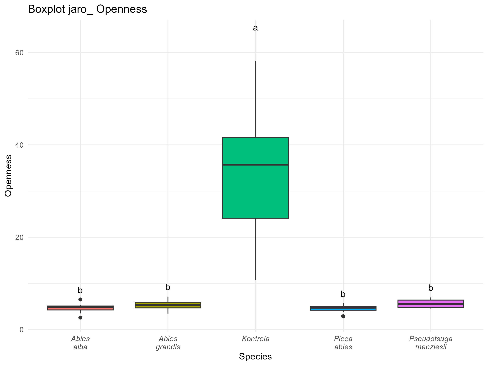

```{r setup 3, include=FALSE}
knitr::opts_chunk$set(echo = TRUE)
# Determine output format (html, pdf, docx) from RMarkdown
output <- knitr::opts_knit$get("rmarkdown.pandoc.to")
if (knitr::is_latex_output()){output<-"pdf"}
if (is.null(output)) {output <- "html"}

# Install and load libraries
options(kableExtra.auto_format = FALSE)
suppressWarnings(lapply(c("kableExtra", "knitr","flextable"), function(pkg) {
  if (!require(pkg, character.only = TRUE))
    install.packages(pkg, repos = "https://mirrors.nic.cz/R/")
  library(pkg, character.only = TRUE)
}))
# Custom function for table creation

default_kable <- function(data, ...) {
  if(output == "docx") {
  flextable(data) %>% 
      set_table_properties(width = 1, layout = "autofit") %>%
      fontsize(size = 7, part = "body") %>% fontsize(size = 8, part = "header") %>%
      height(height = 0.5, part = "body") 
  } else if (output == "pdf") {
    # Output for PDF (LaTeX)
    kable(data, format = "latex", booktabs = TRUE, position = "H", ...) %>%
    kable_styling(font_size = 7)
  } else if (output == "html") {
    kable(data, format = "html", booktabs = TRUE, ...) %>%
      kable_styling(bootstrap_options = c("striped", "hover", "condensed"),
                    font_size = 7, full_width = FALSE, position = "center") %>%
      knitr::asis_output()
  } else {
    # Safety fallback to LaTeX
    kable(data, booktabs = TRUE, ...) %>%
    kable_styling(font_size = 7) %>%
    print()
  }
}
```

\newpage

# 3. Evaluation and Comparison

We usually measure microclimate in the field with the aim of quantifying microclimatic differences between individual sites or to quantify the difference between the microclimate of a site of interest and a reference value for macroclimate, for example from station measurements of the Czech Hydrometeorological Institute (CHMI). The following examples demonstrate how to work with the data and how to verify whether microclimates differ.

## 3.1 Effect of Tree Species on Understory Microclimate

### Introduction

A commonly used approach is to look for significant differences in microclimate between categories. These can be, for example, different tree species, habitat types, various disturbances, etc. Typically, at least 6-10 replicates per category are used if you expect a medium effect and have relatively low variability. If variability is higher or you expect a smaller effect, more independent replicates (10-20) may be needed. In addition to differences between categories, the difference from the control is also useful. In the case of disturbances, mature forest is a good control category. If we are interested in the influence of individual tree species, the control category can be in an open area.

Ideally, individual microclimatic stations should be independent of each other, for example, they should not be too close together. When monitoring the influence of individual trees, the minimum distance corresponds to the longest shadow of the given tree. Apart from the monitored categories, individual locations should not differ in other environmental characteristics - for example, altitude, exposure, shading, etc.

The following example draws from data obtained in 2024 in Průhonice Park. The aim was to compare the influence of conifers on understory microclimate. To eliminate the influence of topography, which creates differences in daily averages of up to 12°C within Průhonice Park (Brůna et al., 2023), we established the experiment within one topoclimatic unit "moderate northern slopes" (Wild et al., 2014).

We found the following species in sufficient numbers and quality to evaluate their influence on microclimate: *Abies alba, Abies grandis, Picea abies* and *Pseudotsuga menziesii*. We selected individual trees 5-9 meters tall, with 8 replicates for each tree species. A TOMST TMS-4 microclimatic station was placed on the north side of each tree trunk. To verify the influence of conifer stands on microclimate in general, 8 microclimatic stations were placed within a nearby young plantation in an open unshaded area.


### Methods

```{r 03-load_library, message=FALSE, warning=FALSE, include=FALSE}
# List of required libraries
required_packages <- c("ggplot2", "multcompView", "myClim", "tidyr", "dplyr")

# Installation and loading of libraries
suppressWarnings(
  lapply(required_packages, function(pkg) {
    if (!require(pkg, character.only = TRUE)) install.packages(pkg, repos = "https://mirrors.nic.cz/R/")
    library(pkg, character.only = TRUE)
  })
)

# Clean up variables in R environment
rm(required_packages)
```

We begin by loading information about files from the files_table.csv table, which needs to be prepared according to the information in chapter 1.4

```{r 03-datatable, message=FALSE, warning=FALSE}
## Loading 'files_table'
ft <- read.table("./data/dreviny/files_table.csv", sep=";", header = TRUE)
# For loading from subfolder, we need to modify the path column (relative path to current folder)
ft$path<-paste0("./data/dreviny/data/",ft$path)
```

```{r 03-read_data, message=FALSE, warning=FALSE}
# Loading logger data with metadata
tms <- mc_read_data(files_table = ft, silent = TRUE)
```

Measurements were conducted from December 15, 2023 to July 22, 2024. For this example, we selected spring March 21 - June 20, 2024. For this period, we calculated average, minimum and maximum temperature and volumetric soil moisture. For calculations using soil moisture, it is important to correctly set the soil type at each site, or alternatively, raw sensor data can be used if the soil is the same everywhere.

```{r 03-calc_summary,message=FALSE, warning=FALSE}
## Cropping time series to selected period - spring
start <- as.POSIXct("2024-03-21", tz = "UTC")
end <- as.POSIXct("2024-06-21", tz = "UTC")
tms.jaro <- mc_prep_crop(tms, start, end, end_included=FALSE)
filename_prefix<-"jaro_"

## Calculation of virtual sensor VWC from raw TMS moisture data
tms.jaro <- mc_calc_vwc(tms.jaro, soiltype = "loamy sand A")

## Calculation of growing and frost degrees (GDD and FDD)
tms.jaro <- mc_calc_gdd(tms.jaro, sensor = "TMS_T3")
tms.jaro <- mc_calc_fdd(tms.jaro, sensor = "TMS_T3")

## Aggregation of all time series, calculation of means, variances 
tms.jaro.vse <- mc_agg(tms.jaro, fun = c("mean", "range", "coverage", 
                                         "percentile", "min", "max", "sum"),
                         percentiles = 95, period = "all", min_coverage = 0.95)

## Conversion to long format (for better data manipulation)
tms.jaro.vse.long <- mc_reshape_long(tms.jaro.vse)

## Conversion to wide format for easier analysis
df_wide.jaro <- tms.jaro.vse.long %>%
  select(-height) %>%
  pivot_wider(names_from = sensor_name, values_from = value)

## Loading site data and removing site "Plaste_40"
lokality_df <- read.csv("./data/dreviny/lokality.csv", sep=";")
lokality_df <- lokality_df[lokality_df$locality_id != "Plaste_40",]
# Joining with data
df_wide.jaro <- lokality_df %>%
  left_join(df_wide.jaro, by = "locality_id")
```

In summer 2024, hemispheric photographs of all sites were taken at a height of 80 cm above ground and canopy cover was derived using the HemisphereR library (Chianucci and Macek 2023). Cover was evaluated for the entire hemisphere and for individual 10° sectors. This allows us to verify microclimate differences caused by canopy cover. From field notes, we know that site Plaste_40 was destroyed and data from it is not available, so we will remove it from the site table as well.

In the site table, we also have a column "drevina" (tree species) which indicates under which tree each TMS-4 station was placed. Similarly, other relevant variables for analysis can be listed here, such as altitude, coordinates, slope, species presence, etc.

```{r 03-metadata, echo=FALSE, message=FALSE, warning=FALSE, tab.cap="Preview of site table including metadata."}
default_kable(head(lokality_df,n=2L))
```

For visualization, we will create box plots that show the median, quartile range, and outliers of measured variables for individual species and control.

Statistical significance at the 95% confidence level will be determined by analysis of variance with post-hoc test (Tukey HSD) for comparing individual species and control (more in Crawley 2013). The significance of differences is indicated directly in the graph using letters (CLD, Compact letter display). Boxplots with the same letter are not significantly different, while those that don't share any letter are significantly different. Differences that are not significant may be due to variability in the data. To increase the chance of detecting significant differences, the number of independent measurements needs to be increased.

### Results

First, we'll generate a graph for one variable - average underground temperature (TMS_T1_mean).

```{r 03-results, message=FALSE, warning=FALSE, fig.cap="Boxplot for individual species with average underground temperature in spring.", fig.width = 5.33, fig.height = 4}
# Variable for analysis
promenna <- "TMS_T1_mean"

# ANOVA
model <- aov(as.formula(paste(promenna, "~ drevina")), data = df_wide.jaro)
tukey <- TukeyHSD(model)

# Compact letter display (CLD)
cld <- multcompLetters4(model, tukey)$drevina
cld_df <- data.frame(drevina = names(cld$Letters), Letters = cld$Letters)

# Modification of species names for two-line display
df_wide.jaro$drevina <- gsub(" ", "\n", df_wide.jaro$drevina)

# Joining with maximum value for correct letter placement in graph
max_values <- df_wide.jaro %>%
  group_by(drevina) %>%
  summarize(max_value = max(.data[[promenna]], na.rm = TRUE))
cld_df <- merge(cld_df, max_values, by = "drevina")

# Creating boxplot
ggplot(df_wide.jaro, aes(x = drevina, y = .data[[promenna]], fill = drevina)) +
  geom_boxplot() +
  geom_text(
    data = cld_df,
    aes(label = Letters, y = max_value + 0.1 * max_value),
    position = position_dodge(width = 0.75),
    vjust = -0.5
  ) +
  labs(
    x = "Species",
    y = promenna
  ) +
  theme_minimal() +
  theme(legend.position = "none", axis.text.x = element_text(face = "italic"))
```

To explore differences in individual climatic variables between species, it's useful to generate graphs for individual variables. The following code generates files into the data/dreviny/vysledky folder.

```{r 03-results_2, message=FALSE, warning=FALSE}
# List of variables for analysis - a graph will be created for each
variables <-
  c("TMS_T1_mean","TMS_T3_mean","TMS_T3_min", 
    "TMS_T3_max", "TMS_T3_range","TMS_T3_percentile95",
    "VWC_moisture_mean","GDD5_sum","FDD0_sum","Openness")

# Function for performing ANOVA, Tukey HSD test and creating boxplots
analyzuj_data <- function(df, promenna, prefix) {

# ANOVA
  model <- aov(as.formula(paste(promenna, "~ drevina")), data = df)
  tukey <- TukeyHSD(model)
  
# Compact letter display (CLD)
  cld <- multcompLetters4(model, tukey)$drevina
  cld_df <-data.frame(drevina = names(cld$Letters),
           Letters = cld$Letters)
  
# Joining with maximum value for correct letter placement in graph
  max_values <- df %>%
    group_by(drevina) %>%
    summarize(max_value = max(.data[[promenna]], na.rm = TRUE))
  cld_df <- merge(cld_df, max_values, by = "drevina")
  
# Creating boxplot
  p <-
    ggplot(df, aes(x = drevina, y = .data[[promenna]], fill = drevina)) +
    geom_boxplot() +
    geom_text(
      data = cld_df,
      aes(label = Letters, y = max_value + 0.1 * max_value),
      position = position_dodge(width = 0.75),
      vjust = -0.5
    ) +
    labs(
      title = paste("Boxplot", prefix, promenna),
      x = "Species",
      y = promenna
    ) +
    theme_minimal() +
    theme(legend.position = "none",
          axis.text.x = element_text(face = "italic"))
  
# Export boxplot in .png format
  ggsave(paste0( "./data/dreviny/vysledky/",
      prefix, promenna,"_boxplot.png"),
    plot = p, width = 8, height = 6 , bg = "white")
}

for (promenna in variables) {
  analyzuj_data(df_wide.jaro, promenna, filename_prefix)
}

```

In this example, the graphs were generated into files that you can find in the files section in the data/dreviny/vysledky folder. Below they are inserted directly as images.

The canopy cover of individual species did not differ significantly in any of the monitored parameters, while the control was always different. Differences in microclimate can thus be attributed mainly to differences between individual species.

{width="500"}

Most climatic parameters at 15 cm above ground were significantly different at control sites, the influence of conifer stands on microclimate is undeniable.

Individual trees can buffer temperature extremes 15 cm above ground. Within spring values, this means reducing maximum temperatures by up to 5°C and increasing minimum temperatures by 2°C.

Temperature parameters in soil did not differ significantly between species and in most cases not even between forest and control.

{width="500"}

The differences in temperature parameters detected at 15 cm above ground between species are not large and were significantly different in only a few parameters. The biggest differences were in maximum temperatures.

Maximum temperatures in spring under *Abies alba* trees differ significantly from those under *Pseudotsuga menziesii* trees and from control. Temperatures under all species differ significantly from control in spring.

{width="500"}

In other parameters there are no significant differences, but a higher buffering effect is still visible, particularly for *Abies alba* and *Picea abies*. Under *Abies grandis* and *Pseudotsuga menziesii* trees, temperatures are often higher.

Volumetric soil moisture is significantly different only between control and species, with no significant difference in this parameter between individual species. At control sites during spring, soil moisture is 15 percentage points higher. This is probably mainly due to rainfall interception by tree branches and water use by tree roots.

{width="500"}

```{r 03-clean, message=FALSE, warning=FALSE, include=FALSE}
# Clean up variables in R environment
rm (df_wide.jaro, filename_prefix, lokality_df, ft, start, end, tms, tms.jaro.vse, 
    tms.jaro, tms.jaro.vse.long, promenna, variables, analyzuj_data, model, tukey,
    cld, cld_df, max_values, promenna)
```

\newpage

## 3.2. Comparison with CHMI Meteorological Stations

### Introduction

We are often interested in whether the microclimate of our location differs from the nearest meteorological station. In June 2024, CHMI published daily data from their stations in machine-readable JSON format. The data also contains historical data in the form of daily averages. For temperatures, this is the SYNOP average, which is calculated from values at 6:00, 13:00, and 20:00 UTC. For simplicity, we will compare these values with daily averages of all measurements from TMS stations.

For examples in sections 3.2 and 3.3, we are loading data from a prepared file, since otherwise it would be necessary to download several GB of data and filter them. At the end of section 3.3, we include a script that we used to obtain and modify this data. When looking for a relevant CHMI station, it is necessary to consider not only its distance but also similar altitude and whether it measures the required variable. If the altitude was significantly different, it can be assumed that a large part of the temperature difference is caused mainly by this difference.

```{r 03-load_library2, message=FALSE, warning=FALSE, include=FALSE}
# Installation and loading of libraries
suppressWarnings(lapply(c("ggplot2", "dplyr", "myClim", "tidyr", "gridExtra"), 
                        function(pkg) {if (!require(pkg, character.only = TRUE))
    install.packages(pkg)
  library(pkg, character.only = TRUE)
}))
```

### Methods

For two locations in the Šumava Mountains, we will find the nearest meteorological station. We will use a prepared file that contains only stations that measured temperature in 2022 and also have calculated distance from our station. By modifying the script at the end of section 3.3, you can download data for other stations according to the required variable. The nearest stations are at Horská Kvilda with WSI: 0-203-0-11494 and at Churáňov, with WSI code: 0-20000-0-11457. Churáňov has a more similar altitude and we will select only this station for further processing.

```{r 03-srovnani_meteo_load, message=FALSE, warning=FALSE}
# Find nearest stations within given radius - WGS84 coordinates and radius in kilometers
stanice_s_informacemi<-readRDS("./data/stanice_s_informacemi.rds")
max_vzdalenost<-5 # 5 km
stanice_v_blizkosti<-stanice_s_informacemi[stanice_s_informacemi$vzdalenost_km
                                           <max_vzdalenost,]
print(stanice_v_blizkosti$WSI)

# Select only Churáňov, as it has more similar altitude
stanice_v_blizkosti<-stanice_s_informacemi[stanice_s_informacemi$WSI=="0-20000-0-11457",]

# Loading prepared data
climate_data<-readRDS("./data/chmu_data_2022.rds")

# Filtering climate_data based on corresponding WSI values 
climate_data <- climate_data[climate_data$STATION %in% stanice_v_blizkosti$WSI, ]
```

Now we will load our 2 locations - this time in TMS_join format - in this form we often provide processed data that may come from a combination of sensors that were at the location over several years. In this example, we use data from a Thermologger placed at a height of 2 m above ground on the north side of a tree.

```{r 03-srovnani_TMS, message=FALSE, warning=FALSE, results='hide'}
# Loading TOMST Thermologger files using files_table
ft <- read.table("./data/stanice/files_table.csv", sep=";", header = TRUE)
ft$path<-paste0("./data/stanice/",ft$path)

# Loading logger data with metadata
tms <- mc_read_data(files_table = ft, silent = TRUE)

# Cropping time series to selected period
start <- as.POSIXct("2022-01-01", tz = "UTC")
end <- as.POSIXct("2023-01-01", tz = "UTC")
tms <- mc_prep_crop(tms, start, end, end_included=FALSE)

# Aggregation of all time series, calculation of means, variances 
tms.agg <- mc_agg(tms, fun = c("mean"), period = "day", min_coverage = 0.95)

# Conversion to long format (for better data manipulation)
tms.agg.long <- mc_reshape_long(tms.agg)

## Conversion to wide format for easier analysis
df_wide.tms <- tms.agg.long %>%
  select(-height) %>%
  pivot_wider(names_from = sensor_name, values_from = value)

# Saving for later use (here saving a table, so saveRDS is sufficient and 
# no need to call myClim::mc_save)
saveRDS(df_wide.tms, file = "./data/dve_tms_sumava.rds")
```

### Results

Now we will create a simple graph with data from the Churáňov station and from our microclimatic stations.

```{r 03-meteo_TMS,message=FALSE,warning=FALSE, fig.cap="At first glance, it is evident that average temperatures have similar patterns and that at TMS stations they are usually lower.", fig.width = 5.33, fig.height = 4}
# Combining datasets into one with added 'locality' column
combined_data <- rbind(
  data.frame(Date = climate_data$DT, 
             Temp = as.numeric(climate_data$VAL), Locality = "CHMI"),
  data.frame(Date = as.Date(df_wide.tms[df_wide.tms$locality_id==
                                          "NPS_4210_D_T1",]$datetime), 
             Temp = df_wide.tms[df_wide.tms$locality_id=="NPS_4210_D_T1",]$Thermo_T_mean, 
             Locality = "NPS_4210_D_T1"),
  data.frame(Date = as.Date(df_wide.tms[df_wide.tms$locality_id=="4220_TMS",]$datetime), 
             Temp = df_wide.tms[df_wide.tms$locality_id=="4220_TMS",]$Thermo_T_mean, 
             Locality = "4220_TMS")
)

# Using a color palette easily distinguishable for colorblind viewers (Okabe-Ito palette)
ggplot(combined_data, aes(x = Date, y = Temp, color = Locality)) +
  geom_line() +
  scale_color_manual(values = c("#E69F00", "#000000", "#009E73")) +  
  labs(title = "Average daily temperature from three sources",
       x = "Date", y = "Temperature (°C)",
       color = "Location") +  
  theme_minimal()
```

The large difference in March is particularly interesting, which we will examine further.

```{r 03-meteo_TMS_crop, message=FALSE,warning=FALSE, fig.cap="In some days, average temperatures differed by up to 10°C. During warm days, average temperatures at TMS stations were lower, while during colder days, average temperatures at TMS stations were higher.", fig.width = 5.33, fig.height = 4}
# Define data range for selection
start_date <- as.Date("2022-03-01")
end_date <- as.Date("2022-03-31")

filtered_data <- combined_data[combined_data$Date >= start_date
                               & combined_data$Date <= end_date,]

# Creating graph for selection
ggplot(filtered_data, aes(x = Date, y = Temp, color = Locality)) +
  geom_line() +
  scale_color_manual(values = c("#E69F00", "#000000", "#009E73")) +
  labs(title = "Average daily temperature from three sources",
       x = "Date", y = "Temperature (°C)",
       color = "Location"
      ) +
  theme_minimal()
```

For easier evaluation, we can look at a histogram of temperature differences between each microclimatic station and the Churáňov station.

```{r 03-meteo_TMS_histogram, message=FALSE,warning=FALSE, fig.cap="Histogram of differences in average daily temperatures between individual TMS stations and average daily temperatures from the CHMI station at Churáňov.", fig.width = 5.33, fig.height = 4}
# Joining datasets GSOD, NPS_4210_D_T1 and 4220_TMS by date
merged_data <- combined_data %>%
  spread(Locality, Temp)

# Calculation of daily differences
merged_data <- merged_data %>%
  mutate(Difference_NPS_CHMU = NPS_4210_D_T1 - CHMI,
         Difference_TMS_CHMU = `4220_TMS` - CHMI)

# Getting x and y axis range for both graphs
x_limits <- range(c(merged_data$Difference_NPS_CHMU,
                    merged_data$Difference_TMS_CHMU),
            na.rm = TRUE)

y_limits <- c(0, max(table( cut(merged_data$Difference_NPS_CHMU,
            breaks = seq(min(x_limits), max(x_limits), by = 0.5))),
            table(cut(merged_data$Difference_TMS_CHMU,
            breaks = seq(min(x_limits), max(x_limits), by = 0.5)))))

# Histogram for difference between NPS_4210_D_T1 and GSOD
p1 <- ggplot(merged_data, aes(x = Difference_NPS_CHMU)) +
  geom_histogram(binwidth = 0.5, fill = "#E69F00",
                 color = "black") +
  geom_vline(xintercept = 0, linetype = "dashed",
             color = "red") +  # Adding line at x=0
  scale_x_continuous(limits = x_limits) +  # Same x axis for both graphs
  scale_y_continuous(limits = y_limits) +  # Same y axis for both graphs
  labs(title = "NPS_4210_D_T1 - CHMI",
       x = "Temperature difference (°C)", y = "Number of days") +
  theme_minimal()

# Histogram for difference between 4220_TMS and CHMI
p2 <- ggplot(merged_data, aes(x = Difference_TMS_CHMU)) +
  geom_histogram(binwidth = 0.5, fill = "#56B4E9",
                 color = "black") +
  geom_vline(xintercept = 0, linetype = "dashed",
             color = "red") +  # Adding line at x=0
  scale_x_continuous(limits = x_limits) +  # Same x axis for both graphs
  scale_y_continuous(limits = y_limits) +  # Same y axis for both graphs
  labs(title = "4220_TMS - CHMI",
       x = "Temperature difference (°C)", y = "Number of days") +
  theme_minimal()

# Displaying graphs side by side
grid.arrange(p1, p2, ncol = 2)
```

A scatterplot can be a good visualization tool, where we see station data on the X axis and microclimatic station data on the Y axis.

```{r 03-meteo_TMS_scatterplot, message=FALSE,warning=FALSE, fig.cap="When using a scatterplot, it's good to observe the position relative to the 1:1 line. This allows us to see that during both cold and warm days, TMS station averages were generally lower, but higher values are not uncommon, even in the cold part. At station NPS_4210_D_T1, averages are mostly lower than Churáňov data.", fig.width = 5.33, fig.height = 4}
# Getting minimum and maximum values for X and Y axes (including 0 and same limits for both axes)
min_limit <- min(c(merged_data$CHMI, 
                   merged_data$NPS_4210_D_T1,
                   merged_data$`4220_TMS`), 
                 na.rm = TRUE)
max_limit <- max(c(merged_data$CHMI, 
                   merged_data$NPS_4210_D_T1,
                   merged_data$`4220_TMS`),
                 na.rm = TRUE)
axis_limits <- c(min(0, min_limit), max_limit)

# Creating scatterplot
ggplot(merged_data, aes(x = CHMI)) +
  # Points for NPS_4210_D_T1 with transparency
  geom_point(aes(y = NPS_4210_D_T1, color = "NPS_4210_D_T1"), alpha = 0.6) + 
  # Points for 4220_TMS with transparency
  geom_point(aes(y = `4220_TMS`, color = "4220_TMS"), alpha = 0.6) +           
  # 1:1 line
  geom_abline(slope = 1, intercept = 0, linetype = "dashed", color = "red") +  
  # Black line at Y = 0
  geom_hline(yintercept = 0, color = "black", size = 0.5) +                    
  # Black line at X = 0
  geom_vline(xintercept = 0, color = "black", size = 0.5) +       
  # Same limits for X and Y axes
  scale_x_continuous(limits = axis_limits) +  
  scale_y_continuous(limits = axis_limits) +  
  labs(title = "Comparison of CHMI stations with NPS_4210_D_T1 and 4220_TMS",
       x = "CHMI Temperature (°C)", y = "Temperature (°C)",
       color = "Location") +  # Legend label
  theme_minimal() +
  scale_color_manual(values = c("NPS_4210_D_T1" = "#E69F00", 
                                "4220_TMS" = "#56B4E9")) +  
  theme(axis.line = element_blank(),)  # Removing axis lines
```

For easier presentation of results, a simple calculation of average daily temperature difference is useful. In microclimate studies, the "buffering effect" of the location is often used.

```{r 03-buffering, message=FALSE,warning=FALSE}
# Calculation of average difference (buffering effect) and standard deviation
buffering_effect <- merged_data %>%
  summarise(
    Mean_Buffering_NPS_4210_D_T1 = mean(Difference_NPS_CHMU, na.rm = TRUE),
    SD_Buffering_NPS_4210_D_T1 = sd(Difference_NPS_CHMU, na.rm = TRUE),
    Mean_Buffering_4220_TMS = mean(Difference_TMS_CHMU, na.rm = TRUE),
    SD_Buffering_4220_TMS = sd(Difference_TMS_CHMU, na.rm = TRUE)
  )

# Creating text output for both locations
cat(sprintf("Vegetation buffering effect at location NPS_4210_D_T1 is %.2f ± %.2f °C\n", 
            buffering_effect$Mean_Buffering_NPS_4210_D_T1,
            buffering_effect$SD_Buffering_NPS_4210_D_T1))

cat(sprintf("Vegetation buffering effect at location 4220_TMS is %.2f ± %.2f °C\n", 
            buffering_effect$Mean_Buffering_4220_TMS,
            buffering_effect$SD_Buffering_4220_TMS))
```

It is evident that the effect is not very large and has a high standard deviation. Testing the significance of such a difference is more complex. The commonly used paired T-test assumes that differences between pairs are independent and have a normal distribution. If individual days are not independent (for example, temperatures between consecutive days may be strongly correlated due to seasonal and daily trends), the assumption of independence may be violated, which will affect the test results. This can lead to:

- **underestimation of variability**: If values are dependent (e.g., temperatures on consecutive days), this can lead to underestimation of variability, which may cause the test to falsely detect statistically significant differences.

- **higher probability of Type I error**: There may be a higher probability of Type I error, meaning we reject the null hypothesis (that there is no difference) even when it is true.

### How to proceed?

The correct procedure is then to use ARIMA models for example **(AutoRegressive Integrated Moving Average)** (Box et Jenkins, 1970). These models are specially designed to capture patterns in time series where values between individual days are dependent on previous values.

How ARIMA works:

- **AR (AutoRegressive)**: The AR part of the model assumes that the current value is a linear combination of previous values (lags).

- **I (Integrated)**: Helps remove trend or seasonal component through differencing (subtracting neighboring values).

- **MA (Moving Average)**: MA model takes into account dependence on previous model errors.

However, this is beyond the scope of this methodology.

```{r 03_cleanup_2, eval=TRUE, message=FALSE, warning=FALSE, include=FALSE}
# Clean up variables in R environment
rm(buffering_effect,combined_data, p1, p2, y_limits, x_limits, climate_data, 
   df_wide.tms, axis_limits, max_limit, min_limit, end_date, start_date, 
   filtered_data,ft, start, end, tms, tms, tms.agg.long, tms.agg, start_year, 
   end_year, station_id, stanice_s_informacemi, stanice_v_blizkosti,
   merged_data, max_vzdalenost)
```

\newpage

## 3.3. Comparison with Stations Across the Czech Republic

### Introduction

Here we will again use the GSODR library, but we'll look at how our stations compare to temperatures across the Czech Republic along an elevation gradient.

```{r 03-srovnani_meteo_CZE_library, message=FALSE, warning=FALSE, include=FALSE}
# Installation and loading of libraries
suppressWarnings(
  lapply(c("ggplot2", "dplyr", "tidyr"), function(pkg) {
    if (!require(pkg, character.only = TRUE)) install.packages(pkg)
    library(pkg, character.only = TRUE)
  })
)
```

### Methods

We'll select one day and download data from stations in the Czech Republic for that day (data is downloaded by whole years, then filtered)

```{r 03-srovnani_meteo_CZE_load,message=FALSE, warning=FALSE}
# Enter date of interest
date_of_interest <- as.Date("2022-09-01")

# Loading prepared data
stanice_s_informacemi<-readRDS("./data/stanice_s_informacemi.rds")
climate_data<-readRDS("./data/chmu_data_2022.rds")

# Joining station information with temperature data
climate_data <- climate_data %>%
  left_join(stanice_s_informacemi, by = c("STATION" = "WSI"), 
            relationship = "many-to-many")

# Data adjustment
climate_data$VAL<-as.numeric(climate_data$VAL)
climate_data$ELEVATION<-as.numeric(climate_data$ELEVATION)

# Filtering data for specific date
filtered_data <- subset(climate_data, DT == date_of_interest)
```

And now we'll load data from the same microclimatic stations as in the previous example. Additionally, we'll add their elevation so we can compare them with stations in the Czech Republic in the graph and filter for the selected day.

```{r 03-srovnani_meteo_CZE_TMS,message=FALSE, warning=FALSE}
# Loading data
df_wide.tms<-readRDS("./data/dve_tms_sumava.rds")
# Adding elevation
df_wide.tms$elevation <- 1120
df_wide.tms$mean_temp <- df_wide.tms$Thermo_T_mean
# Filtering for selected day
filtered_tms <- subset(df_wide.tms, as.Date(datetime) == date_of_interest)
```

### Results

And now we'll create a graph for the selected day (September 1, 2022), where we'll also add a simple regression of temperature and elevation with confidence intervals.

```{r 03-lapse_rate, message=FALSE, warning=FALSE, fig.cap="It can be seen that on September 1, 2022, the average temperature at the station did not deviate from values across the Czech Republic. However, the graph also shows that there are few stations in mountain locations."}
# Check if data is available for given date
if (nrow(filtered_data) > 0) {
  # Create scatter plot temperature vs. elevation with trend line
  p <- ggplot(filtered_data, aes(x = ELEVATION, y = VAL)) +
    geom_point(color = "blue", alpha = 0.7) +
    # Adding regression line and confidence intervals
    geom_smooth(method = "lm", se = TRUE, color = "black", linetype = "dashed",
                fill = "lightblue", alpha = 0.3) +  
    labs(title = paste("Temperature vs. elevation on", date_of_interest, 
                       "source: CHMI"),
         x = "Elevation (m a.s.l.)", y = "Average daily temperature (°C)") +
    theme_minimal()
  
  # Adding data from logger stations as red points
  p <- p + 
    geom_point(data = filtered_tms, aes(x = elevation, y = mean_temp), 
               color = "red", size = 3)
  # Displaying graph
  print(p)
} else {
  cat("No data available for selected date:", date_of_interest, "\n")
}
```

And how was it on other days? We'll use the fact that we already have the data loaded, we just select (filter) a different day.

```{r 03-lapse_rate_2, message=FALSE, warning=FALSE, fig.cap="On January 12, 2022, the temperature at our stations was lower than we would expect based on stations in the Czech Republic at this elevation, which corresponds to the value at Churáňov. We can speculate whether this was due to the influence of snow in the forest or just simple shading during a sunny winter day."}
# Enter date of interest
date_of_interest <- as.Date("2022-01-12")

# Filter data for specific date
filtered_data <- subset(climate_data, DT == date_of_interest)
filtered_tms <- subset(df_wide.tms, as.Date(datetime) == date_of_interest)

# Check if data is available for given date
if (nrow(filtered_data) > 0) {
  # Create scatter plot temperature vs. elevation with trend line
  p <- ggplot(filtered_data, aes(x = ELEVATION, y = VAL)) +
    geom_point(color = "blue", alpha = 0.7) +
    # Adding regression line and confidence intervals
    geom_smooth(method = "lm", se = TRUE, color = "black", linetype = "dashed",
                fill = "lightblue", alpha = 0.3) +  
    labs(title = paste("Temperature vs. elevation on", date_of_interest, 
                       "source: CHMI"),
         x = "Elevation (m a.s.l.)", y = "Average daily temperature (°C)") +
    theme_minimal()
  
  # Adding data from logger stations as red points
  p <- p + 
    geom_point(data = filtered_tms, aes(x = elevation, y = mean_temp), 
               color = "red", size = 3)
  # Displaying graph
  print(p)
} else {
  cat("No data available for selected date:", date_of_interest, "\n")
}
```

And what about during a temperature inversion? This occurred for example on October 31, 2022.

```{r 03_lapse_rate_3, message=FALSE, warning=FALSE, fig.cap="In this case too, the temperature at our stations was lower than would correspond to meteorological stations in open areas."}
# Date of interest
date_of_interest <- as.Date("2022-10-31")

# Filter data for specific date
filtered_data <- subset(climate_data, DT == date_of_interest)
filtered_tms <- subset(df_wide.tms, as.Date(datetime) == date_of_interest)

# Check if data is available for given date
if (nrow(filtered_data) > 0) {
  # Create scatter plot temperature vs. elevation with trend line
  p <- ggplot(filtered_data, aes(x = ELEVATION, y = VAL)) +
    geom_point(color = "blue", alpha = 0.7) +
    # Adding regression line and confidence intervals
    geom_smooth(method = "lm", se = TRUE, color = "black", linetype = "dashed",
                fill = "lightblue", alpha = 0.3) +  
    labs(title = paste("Temperature vs. elevation on", date_of_interest, 
                       "source: CHMI"),
         x = "Elevation (m a.s.l.)", y = "Average daily temperature (°C)") +
    theme_minimal()
  # Adding data from logger stations as red points
  p <- p + 
    geom_point(data = filtered_tms, aes(x = elevation, y = mean_temp), 
               color = "red", size = 3)
  # Displaying graph
  print(p)
} else {
  cat("No data available for selected date:", date_of_interest, "\n")
}
```

```{r 03_cleanup_3, message=FALSE, warning=FALSE, include=FALSE}
# Clean up variables in R environment
rm(climate_data, ft, tms, tms.agg, tms.agg.long, start, end, year_of_interest, 
   tms.all,p, df_wide.tms, filtered_data, date_of_interest, merged_data, stanice_s_informacemi)
```

### Script for Downloading and Filtering CHMI Data

The following script is what we used to prepare the materials for chapters 3.2 and 3.3. By modifying it, you can download data for other stations, variables, or time periods.

```{r 03-stazeni-chmu-funkce, message=FALSE, warning=FALSE, eval=FALSE, results='hide'}
# List of required libraries
required_packages <- c("jsonlite", "lubridate", "sf", "dplyr", "stringr")

# Installation and loading of libraries
suppressWarnings(
  lapply(required_packages, function(pkg) {
    if (!require(pkg, character.only = TRUE)) install.packages(pkg, 
                               repos = "https://mirrors.nic.cz/R/")
    library(pkg, character.only = TRUE)
  })
)
rm(required_packages)

# Function definitions
# Function for downloading metadata and filtering stations based on available variable and year
ziskat_stanice_s_dostupnou_promennou <- function(rok, element) {
  # Downloading metadata file meta2.json using curl
  metadata_url <- 
    "https://opendata.chmi.cz/meteorology/climate/historical/metadata/meta2.json"
  metadata_file <- tempfile(fileext = ".json")
  system(paste("curl -o", metadata_file, metadata_url))
  # Loading metadata from file
  metadata <- fromJSON(metadata_file)   
  # Processing metadata, extracting values and filtering by variable and year
  metadata_df <- data.frame(metadata$data$data$values)
  colnames(metadata_df) <- unlist(strsplit(metadata$data$data$header, ","))
  # Filtering stations that have available data for chosen year and variable (element)
  stanice_s_promennou <- metadata_df %>%
    filter(EG_EL_ABBREVIATION == element) %>%
    mutate(BEGIN_DATE = as.Date(BEGIN_DATE),
           END_DATE = as.Date(END_DATE),
           HEIGHT=as.numeric(HEIGHT)) %>%
    filter(year(BEGIN_DATE) <= rok & year(END_DATE) >= rok & HEIGHT < 2.5 & HEIGHT > 1.9)
  return(stanice_s_promennou)
}

# Function for loading meta1.json and joining station information with filtering by year
pripojit_meta1 <- function(stanice_s_promennou, rok) {
  # Downloading meta1.json using download.file
  metadata1_url <- 
    "https://opendata.chmi.cz/meteorology/climate/historical/metadata/meta1.json"
  metadata1_file <- tempfile(fileext = ".json")
  download.file(metadata1_url, metadata1_file)
  metadata1 <- fromJSON(metadata1_file)
  # Extracting information from meta1.json and creating data frame
  metadata1_df <- data.frame(metadata1$data$data$values)
  colnames(metadata1_df) <- c("WSI", "GH_ID", "BEGIN_DATE", "END_DATE", "FULL_NAME", 
                              "GEOGR1", "GEOGR2", "ELEVATION")
  # Converting BEGIN_DATE and END_DATE to Date format
  metadata1_df <- metadata1_df %>%
    mutate(BEGIN_DATE = as.Date(BEGIN_DATE),
           END_DATE = as.Date(END_DATE))
  # Filtering based on given year and ensuring GEOGR1 and GEOGR2 are not NA
  metadata1_df_filtered <- metadata1_df %>%
    filter(year(BEGIN_DATE) <= rok & year(END_DATE) >= rok) %>%
    filter(!is.na(GEOGR1) & !is.na(GEOGR2))
  # Joining information from meta1 to stanice_s_promennou table using left_join
  stanice_s_informacemi <- stanice_s_promennou %>%
    left_join(metadata1_df_filtered, by = "WSI")
  stanice_s_informacemi <- stanice_s_informacemi %>%
    filter(!is.na(GEOGR1) & !is.na(GEOGR2))
  return(stanice_s_informacemi)
}

# Function for calculating distance in kilometers in UTM33N
vypocet_vzdalenosti_utm33n <- function(lat1, lon1, lat2, lon2) {
  # Creating sf objects for points
  bod1 <- st_as_sf(data.frame(lon = lon1, lat = lat1), 
                   coords = c("lon", "lat"), crs = 4326)
  bod2 <- st_as_sf(data.frame(lon = lon2, lat = lat2), 
                   coords = c("lon", "lat"), crs = 4326)
  # Transforming coordinates to UTM33N (EPSG:32633)
  bod1_utm <- st_transform(bod1, 32633)
  bod2_utm <- st_transform(bod2, 32633)
  # Calculating distance in meters and converting to kilometers
  vzdalenost_m <- st_distance(bod1_utm, bod2_utm)
  vzdalenost_km <- as.numeric(vzdalenost_m) / 1000
  return(vzdalenost_km)
}

# Function for filtering stations based on distance from given point
filtrovat_stanice_dle_vzdalenosti <- function(stanice_df, lat, lon, max_vzdalenost_km) {
  # Calculating distance for each station
  stanice_df <- stanice_df %>%
    rowwise() %>%
    mutate(vzdalenost_km = vypocet_vzdalenosti_utm33n(lat, lon, as.numeric(GEOGR2), 
                                                      as.numeric(GEOGR1))) %>%
    ungroup() %>%
    # Filtering by distance
    filter(vzdalenost_km <= max_vzdalenost_km)  
  return(stanice_df)
}

# Function for loading and cleaning JSON file with jsonlite
ziskat_data_stanice_pro_rok <- function(stanice_id, element, vtype, rok) {
  # Folder for storing data
  dir.create("./data/stanice", recursive = TRUE, showWarnings = FALSE)
  filename <- paste0("./data/stanice/dly-", stanice_id, ".json")
  
  # If file exists, load it, otherwise download it
  if (!file.exists(filename)) {
    # Modified URL format for downloading without specifying year
    data_url <- 
      paste0("https://opendata.chmi.cz/meteorology/climate/historical/data/daily/dly-", stanice_id, ".json")
    # Download file using curl
    download_command <- paste("curl -w '%{http_code}' -o", shQuote(filename), data_url)
    status_code <- system(download_command, intern = TRUE)
    
    # Ensure we check only first value of status_code
    if (length(status_code) == 0 || status_code[1] != "200") {
      message("File is not available or cannot be downloaded (HTTP status: ", status_code, "): ", data_url)
      return(NULL)
    }
  }
  
  # Attempt to load JSON data using jsonlite with error handling
  data <- tryCatch({
    fromJSON(filename, simplifyVector = TRUE)  # Loading JSON file using jsonlite
  }, error = function(e) {
    # If error occurs, print error and skip file
    message("Error loading JSON file using jsonlite: ", filename, " - ", e$message)
    return(NULL)  # Skip this file and return NULL
  })
  
  if (is.null(data)) {
    return(NULL)  # If JSON file wasn't loaded, skip file
    }
  
  # Check if JSON contains data
  if (!"data" %in% names(data)) {
    message("Missing data in downloaded file: ", filename)
    return(NULL)
  }
  
  # Attempt to convert data to data frame
  data_filtered <- tryCatch({
    as.data.frame(data$data$data$values)
  }, error = function(e) {
    message("Error converting data to data frame: ", e$message)
    return(NULL)
  })
  
  if (is.null(data_filtered)) {
    return(NULL)  # Skip file if data cannot be converted to dataframe
  }

  # Assigning column names
  colnames(data_filtered) <- unlist(strsplit(data$data$data$header, ","))
  
  # Filtering by ELEMENT and VTYPE
  data_filtered <- data_filtered %>%
    filter(ELEMENT == element, VTYPE == vtype)
  
  # Converting DT to date and filtering for entire year 2022
  data_filtered$DT <- as.Date(data_filtered$DT)
  data_filtered <- data_filtered %>%
    filter(year(DT) == rok)
  
  # Adding station identifier
  data_filtered$stanice_id <- stanice_id
  
  return(data_filtered)
}

# Function for getting data for all stations for year 2022
ziskat_data_ze_vsech_stanic <- function(stanice_s_informacemi, element, vtype, rok) {
  # Initializing empty dataframe
  vysledna_data <- data.frame()  
  for (i in 1:nrow(stanice_s_informacemi)) {
    stanice_id <- stanice_s_informacemi$WSI[i]
    message("Processing station with WSI: ", stanice_id)
    data <- ziskat_data_stanice_pro_rok(stanice_id, element, vtype, rok)
    if (!is.null(data)) {
      # Adding data for each station
      vysledna_data <- rbind(vysledna_data, data)  
    }
  }
  return(vysledna_data)
}
```

Now we set the variables: coordinates, monitored variable and its type, maximum distance, and year. In this case, we set the distance to 750 km to get all stations that measured temperature in 2022.

```{r 03-stazeni-chmu-data, message=FALSE, warning=FALSE, eval=FALSE}
# Setting coordinates, year of interest, ELEMENT, VTYPE, maximum distance and specific date
lat <- 49.0679850   # Latitude
lon <- 13.5678442   # Longitude
element <- "T"      # ELEMENT parameter, e.g., "T" (temperature)
vtype <- "AVG"      # VTYPE parameter, e.g., "AVG" (average value)
max_vzdalenost_km <- 750  # Maximum distance in kilometers
rok <- 2022

# Getting list of stations that have available data for given year and variable
stanice_s_promennou <- ziskat_stanice_s_dostupnou_promennou(rok, element)

# Joining information from meta1 with filtering based on year and available coordinates
stanice_s_informacemi <- pripojit_meta1(stanice_s_promennou, rok)
stanice_s_informacemi <- stanice_s_informacemi[!is.na(stanice_s_informacemi$GEOGR1) & 
                                                 !is.na(stanice_s_informacemi$GEOGR2), ]

# Filtering stations based on distance from given point
stanice_s_informacemi <- filtrovat_stanice_dle_vzdalenosti(stanice_s_informacemi, 
                                                           lat, lon, max_vzdalenost_km)

# Save list of stations that meet conditions including their metadata
saveRDS(stanice_s_informacemi, file = "./data/stanice_s_informacemi.rds")
```

Now we just need to download data for selected stations and save them to the chmu_data_2022 table.

```{r 03-stazeni-chmu-final, message=FALSE, warning=FALSE, eval=FALSE}
# Getting temperature data for all stations for entire year 2022
chmu_data_2022 <- ziskat_data_ze_vsech_stanic(stanice_s_informacemi, element, vtype, rok)

# Saving data to file in RDS format for further processing
saveRDS(chmu_data_2022, file = "./data/chmu_data_2022.rds")
```

```{r 03_cleanup_4, eval=TRUE, message=FALSE, warning=FALSE, include=FALSE, eval=FALSE}
# Clean up variables in R environment
rm(stanice_s_informacemi, stanice_s_promennou, element, lat, lon, max_vzdalenost_km, 
   rok, vtype, filtrovat_stanice_dle_vzdalenosti, pripojit_meta1, vypocet_vzdalenosti_utm33n,
   ziskat_data_ze_vsech_stanic, ziskat_stanice_s_dostupnou_promennou)
```

\newpage

## 3.4. Comparison with Data Worldwide

Daily data from various stations around the world can be obtained using the GSODR library. The data comes from GSOD, or Global Surface Summary of the Day. The data is provided by the National Centers for Environmental Information USA (NCEI) and is a valuable source of meteorological data with worldwide coverage. Currently, 40 stations in the Czech Republic are included. In addition to the availability of international data, the advantage is also the speed of processing without the need to download a large number of JSON files. This way, data from approximately 9,000 stations is available, some of which have data from 1929. The global coverage of stations can be seen in **Figure 32**.


### Methods

```{r 03-load_library3, message=FALSE, warning=FALSE, include=FALSE, eval=FALSE}
# Installation and loading of libraries
suppressWarnings(lapply(c("GSODR"), function(pkg) {
  if (!require(pkg, character.only = TRUE))
    install.packages(pkg)
  library(pkg, character.only = TRUE)
}))
```

Let's try again to download data from the Churáňov station, whose ID in the GSOD database is "114570-99999". We'll use this to obtain daily data from 2022. Again, we'll load data from our two stations and join them with GSOD data.

```{r 03-gsod-single, message=FALSE, warning=FALSE, results='hide'}
# Find nearest stations within given radius - WGS84 coordinates and radius in kilometers
GSODR::nearest_stations(LAT = 49.0679850, LON = 13.5678442, distance = 20)

# Download data for given location and period
station_id <- "114570-99999"  # Churáňov
start_year <- 2022
end_year <- 2022

# Error handling for download attempt - GSOD is occasionally unavailable
tryCatch({
  # Try to download data from GSODR
  climate_data_gsod <- GSODR::get_GSOD(start_year:end_year, station = station_id)
}, error = function(e) {
  # In case of error, load prepared data from file
  message("Failed to download data, loading saved data from file.")
  climate_data_gsod <- readRDS("./data/gsod_Churanov_2022.rds")
})

# Loading saved TMS stations (see chapter 3.2)
df_wide.tms<-readRDS("./data/dve_tms_sumava.rds")

# Combining datasets into one with added 'locality' column
combined_data <- rbind(
  data.frame(Date = as.Date(climate_data_gsod$YEARMODA), 
             Temp = climate_data_gsod$TEMP, Locality = "GSOD Churáňov"),
  data.frame(Date = as.Date(df_wide.tms[df_wide.tms$locality_id==
                                          "NPS_4210_D_T1",]$datetime), 
             Temp = df_wide.tms[df_wide.tms$locality_id=="NPS_4210_D_T1",]$Thermo_T_mean, 
             Locality = "NPS_4210_D_T1"),
  data.frame(Date = as.Date(df_wide.tms[df_wide.tms$locality_id==
                                          "4220_TMS",]$datetime), 
             Temp = df_wide.tms[df_wide.tms$locality_id==
                                  "4220_TMS",]$Thermo_T_mean, 
             Locality = "4220_TMS")
)
```

### Results

Now let's look at the average temperature progression in March 2022.

```{r 03-meteo_TMS_gsodr,message=FALSE,warning=FALSE, fig.cap="Here we can see that data in the GSOD database is not identical to CHMI data. This is partly due to a different method of calculating the average, and partly it may be due to further modification of data within GSOD."}

# Define data range for selection
start_date <- as.Date("2022-03-01")
end_date <- as.Date("2022-03-31")
filtered_data <- combined_data[combined_data$Date >= start_date
                               & combined_data$Date <= end_date,]

# Creating graph for selection
ggplot(filtered_data, aes(x = Date, y = Temp, color = Locality)) +
  geom_line() +
  scale_color_manual(values = c("#E69F00", "#000000", "#009E73")) +
  labs(
    title = "Average daily temperature from three sources",
    x = "Date",
    y = "Temperature (°C)",
    color = "Location"
  ) +  # Legend label
  theme_minimal()
```

```{r 03_cleanup_5, eval=TRUE, message=FALSE, warning=FALSE, include=FALSE, eval=FALSE}
# Clean up variables in R environment
rm(ft, start, end, tms, tms, tms.agg.long, tms.agg, start_year, 
   end_year, station_id,end_date, start_date, filtered_data, climate_data_gsod)
```

Alternatively, we can download data for the entire country and filter for a selected day as in section 3.3.

```{r 03-gsod-country, message=FALSE, warning=FALSE, eval=FALSE}
# Enter date of interest
date_of_interest <- as.Date("2022-09-01")

# Download data for year selected by date of interest for Czech Republic
year_of_interest <- format(date_of_interest, "%Y")
climate_data_cz <- GSODR::get_GSOD(as.integer(year_of_interest),
                            station = NULL,
                            country = "CZE",
                            max_missing = NULL,
                            agroclimatology = FALSE)

# Filter data for specific date
filtered_data <- subset(climate_data_cz, YEARMODA == date_of_interest)
```

However, it will be more interesting to compare data from TMS stations with data from stations within 250 km, instead of the whole Czech Republic, since the location is close to the borders.

```{r 03-gsod-multi, message=FALSE, warning=FALSE, results='hide', eval=FALSE}
# Period
start_year <- 2022
end_year <- 2022

# Find nearest stations within given radius (in km)
stations_nearby <- GSODR::nearest_stations(LAT = 49.0679850, LON = 13.5678442, 
                                           distance = 250)

# It's evident there are errors in station data, we'll remove obvious ones
stations_nearby<-stations_nearby[!stations_nearby$COUNTRY_NAME=="GUAM",]
stations_nearby<-stations_nearby[!stations_nearby$COUNTRY_NAME=="IRAN",]
stations_nearby<-stations_nearby[!stations_nearby$COUNTRY_NAME=="IRAQ",]
stations_nearby<-stations_nearby[!is.na(stations_nearby$`ELEV(M)`),]

# Download GSOD data for all stations within 250 km
# Using lapply function to download data from multiple stations
climate_data_nearby <- lapply(stations_nearby$STNID, function(station_id) {
  get_GSOD(years = start_year:end_year, station = station_id)
})

# Merging all downloaded data into one data frame
climate_data_nearby <- do.call(rbind, climate_data_nearby)

# For faster processing we'll save the data, this part of code doesn't run automatically
# to avoid overloading storage, if you change the radius, run again. 
# Current setting downloads 291 stations.

saveRDS(climate_data_nearby, file = "./data/gsod_nearby_2022.rds")
```

And now we'll create a graph again for the selected day (September 1, 2022), where we'll add a simple regression of temperature and elevation with confidence intervals. This time, however, data from surrounding stations within GSOD is used.

```{r 03-gsod-multi-lapse-rate, message=FALSE, warning=FALSE, fig.cap="Although the graph looks similar, from the distribution of stations along the elevation gradient it is evident that these are different stations."}
# Loading saved TMS stations (see chapter 3.2)
df_wide.tms<-readRDS("./data/dve_tms_sumava.rds")
climate_data_nearby<-readRDS("./data/gsod_nearby_2022.rds")
# Adding elevation
df_wide.tms$elevation <- 1120

# Enter date of interest
date_of_interest <- as.Date("2022-09-01")

# Filtering data for specific date
filtered_data <- subset(climate_data_nearby, as.Date(YEARMODA) == date_of_interest)
filtered_data_tms <- subset(df_wide.tms, as.Date(datetime) == date_of_interest)

# Check if data is available for given date
if (nrow(filtered_data) > 0) {
  # Create scatter plot temperature vs. elevation with trend line
  p <- ggplot(filtered_data, aes(x = ELEVATION, y = TEMP)) +
    geom_point(color = "blue", alpha = 0.7) +
    # Adding regression line and confidence intervals
    geom_smooth(method = "lm", se = TRUE, color = "black", linetype = "dashed",
                fill = "lightblue", alpha = 0.3) +  
    labs(title = paste("Temperature vs. elevation on", date_of_interest, "source: GSOD"),
         x = "Elevation (m a.s.l.)", y = "Average daily temperature (°C)") +
    theme_minimal()
  # Adding data from logger stations as red points
  p <- p + geom_point(data = filtered_data_tms, aes(x = elevation, y = Thermo_T_mean), 
           color = "red", size = 3)
  print(p)
} else {
  cat("No data available for selected date:", date_of_interest, "\n")
}
```

```{r 03_cleanup_6, eval=TRUE, message=FALSE, warning=FALSE, include=FALSE, eval=FALSE}
# Clean up variables in R environment
rm(stations_nearby, start_year, end_year, station_id, filtered_data, filtered_data_tms, climate_data_nearby)
```